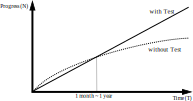
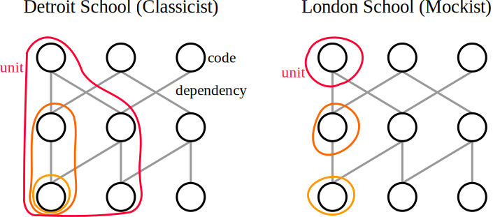
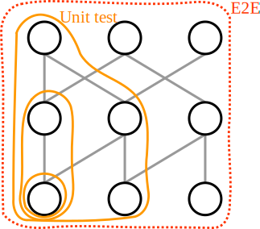
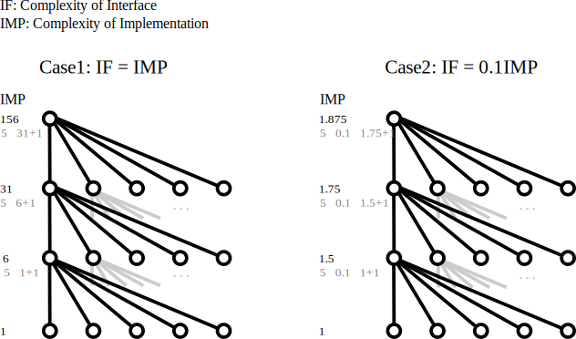

# 持続可能な開発のためのテストと設計哲学

開発の速度を維持することを大目標とし、テストと設計が満たすべき条件を導出する

想定読者：

- テストをどう書けば良いか知りたい人
- 設計手法を原理から考えたい人
- 何が開発速度のボトルネックになりうるかを知りたい人

## 1. テストの必要性（テストの不可避性）

仮に速度を優先したとしても、実は長期的にはテストを書く方が速くなる。というより、**長期的にはテストが無いと開発が続行不可能になる**。そのことを示す

### 1-1. 仕様変更への耐性を持たせるため

現実の開発において、仕様は様々な理由で変わりうる。そして、残念ながら万能な設計というものはなく、最適な設計は仕様によって変わる。なので、設計を変えずに無理に新しい仕様を満たそうとすると、そのしわ寄せが開発速度の悪化、バグの増加といった形で現れる

頻繁な仕様変更があっても開発速度を落とさないようにするには、リファクタリングによって、定期的に設計が仕様に合っているかを見直し続ける必要がある。そして、リファクタリングには、自動テストによる退行（デグレ）の検出が不可欠

- 仮にチェックすべき箇所が 1000 あるとすると、テストがなければ、リファクタリングのたびに 1000 箇所すべてを人力で確認する羽目になる。しかも、その数は開発の進行とともに増え続ける

### 1-2. 規模拡大への耐性を持たせるため

簡略化したモデルで分析し、テストの有無によって、オーダーレベルで進捗に差が生まれることを示す

#### 仮定

- モジュール数：N
- 既存のモジュールの改修は局所的（定数個の範囲内）
	- これを実現するための設計手法は 3 章で議論
- 各モジュールは定数個のモジュールに依存
- 機能追加のたびに手動でのデグレ確認・改修が必要なモジュール数：
	- **テストなし**：確認 $N$ + 改修 $O(1)$ → $O(N)$
	- **テストあり**：確認 $O(1)$ + 改修 $O(1)$ → $O(1)$

#### 結果

進捗（モジュール数） $N$ が経過時間 $T$ の関数であり、 $T=0$ で $N=0$ とすると：

- **テストなし**： $N = O(\sqrt{T})$
	- $\displaystyle {dN \over dT} = {C\over N} \rightarrow N = \sqrt{2CT}$（C は定数）
- **テストあり**： $N = O(T)$
	- $\displaystyle {dN \over dT} = C \rightarrow N = CT$（C は定数）

このように、テストがあれば進捗は時間に比例するが、テストがなければ進捗は時間の平方根に比例してしまう。経験的には、この損益分岐点は 1 ヶ月〜1 年 程度である（書籍によって主張に幅がある）

#### 注意点

現実のプロジェクトでは途中で大幅な仕様変更がありうるので、上記の仮定の「既存のモジュールの改修は局所的」が成り立たない場合もある。また、プロジェクトが筋の悪い設計をしていた場合にも成り立たなくなってしまう（詳しくは第 3 章で述べるが、ワーストケースで $O(\sqrt{T})$ に落ち込んでしまう）。なので、プロジェクトによっては上記の分析ほどの極端な差にはならないケースがあることに注意

## 2. どうテストするか？

### 2-1. 全体観：マイクロ・マネジメントを避ける

**テストすべきは「機能」であり、「コード」ではない**

- 機能：使用者から見た振る舞い
- 学校のテストに例えるなら、「問題を解けるか」が重要であり、「教師が教えた解法どおりか」は本質ではない

### 2-2. 具体的な推奨スタイル

先に推奨するテストの概形を述べ、次節以降で詳細・意味・理由を説明する

- **古典学派のテスト**を使用する
	- 実際の依存物（本物）を極力使用し、やむを得ないときのみモックを使用
- **ブラックボックステスト**を優先する
- **入出力の関係**だけをなるべくテストする
- **テストする価値の低い箇所**はテストしない
	- テストもまたメンテナンス対象なので、コストに見合わないなら書かない判断もアリ
	- テストする価値：
		- ビジネス的重要度
			- バグが出てもビジネスに影響がないような箇所は、優先度を下げられる
		- 複雑度
			- 単に値を下位モジュールに渡すだけのコントローラーなどは、単体テストを書くメリットが少ない
		- 確実性
			- 仕様が不確実なほど、実装・テストが無駄になりやすい

### 2-3. なぜ古典学派か？（単体テストの「単体」とは何か）

ソフトウェアのテストには、古典学派とロンドン学派という二大流派がある。古典学派とロンドン学派の最大の違いは、コードの依存グラフのうち、どこまでをモジュールの一単位とみなすかである。古典学派の考える一単位と、ロンドン学派が考える一単位のイメージを下図に示す（左が古典学派、右がロンドン学派）：

古典学派は全ての依存を含めた、実際に機能する単位を単体とみなしている。一方ロンドン学派は、関数やクラスといった、コードとしての単位を単体としている。言い換えるなら、古典学派は機能を検証し、ロンドン学派はコードを検証している

古典学派にとって、単体テストと結合テストは同じものであり、単体テストでは依存する全てのモジュールの機能も同時に検証することになる。このことには強力な利点がある：

- **リファクタリング時の偽陽性を防げる**：古典学派の関心は機能であり、モジュール内部で何を呼び出しているかは関知しないので、リファクタリングに耐性がある
- **仕様改修時の偽陰性を防げる**：モジュールの返り値を変えた場合、本来ならそのモジュールに依存するモジュールも改修しないといけない。古典学派なら上位のテストが落ちてくれるので、改修漏れを検出できる。一方ロンドン学派だとモックを使うため、そのままでもテストが通ってしまい、改修漏れを自動検出できない
- **モジュール作者間の認識齟齬を検出できる**：具体的には、「あるモジュールが、その作者の想定通りに機能しているか」だけでなく、「そのモジュールが、使う側が求めている通りの機能を提供できているか」、ひいては「そのモジュールが呼ばれた階層の、他のモジュールと正しく連携ができるか」まで検証できる
	- 例えば、string を引数に取り、返り値が int の関数があったとして、モジュール作者は文字数を返す想定だったが、モジュール利用側は byte 数を返す関数のつもりで使ってしまうかもしれない。そして、モックを使うロンドン学派のテストだと、モジュール利用側は byte を返すという思い込みをそのままモックに反映してしまうので、認識齟齬があることに気付けない

### 2-4. テスト階層

前節で、古典学派の単体テストでは、依存モジュール間の整合性を検証できると述べた。では、依存グラフでいう一番上の頂点間の整合性はどこで検証するのだろうか？それを担うのが E2E テストである

このように考えると、E2E テストは単体テストの延長上に自然に導出される。ここでテストの階層を表にまとめる：

| 階層                | 責任範囲        | フィードバック速度 | 改修への耐性                    | 1 件あたりのコスト |
| :---------------- | :---------- | --------- | ------------------------- | ---------- |
| E2E テスト           | アプリケーションレベル | 低         | 高（設計変更に強く、仕様変更には弱い）       | 中          |
| 単体テスト （＝結合テスト） | 機能レベル       | 高         | 中（実装変更に強く、設計変更に弱い。高層ほど高い） | 低          |
| 静的解析              | コードレベル      | 最高        | 無                         | 無          |

一般に有用なプラクティスを述べる：

- 低層でのテストを優先する
	- 低層のテストほどフィードバックが早い。そして、バグの発見は早いほど良い
	- utilやrepositoryなどの低層のモジュールほど汎用性が高くなりやすいため、仕様の不確実性の影響を受けにくい。そして、仕様の不確実性は時間経過とともに下がる
	- 低層のモジュールの改修は高層のモジュールに影響を与えるため
- 静的解析を用いた型による意味的検証は有用。引数や返り値の型を適切に定めることで取りうる状態を削減し、チェックすべき観点自体を減らすことが出来る
	- 例えば、単なる `string` ではなく `AccessToken` 型にすることで、同じ文字列でも `RefreshToken` と区別できる

## 3. どう設計するか？

### 3-1. 良い設計とは

良い設計とは、開発を持続可能にする設計のことである。開発を持続可能にするためには、改修時の認知負荷が可能な限り小さい必要がある。なぜなら、第 1 章の議論と似たことが、設計においても言えるからである。例えば、現在の進捗を $N(T)$ 、コード全体の認知コストを $C = O(N)$ として、

- 最悪の設計は、改修のたびにアプリケーションの実装の大部分を意識しないといけない設計。なぜなら、認知負荷が $O(C) = O(N)$ となるので、進捗が $O(\sqrt{T})$ となり、すぐに持続不可能になるからである
	- いわゆる「神クラス」はこのケースに陥りやすいため、悪い設計の可能性大
	- 人間のワーキングメモリーは有限なので、認知負荷が一定量を超えると急激に認識が困難になる可能性もある
		- 開発者に高知能を要求する設計は、多人数開発ではスケールしないので避けるべき
- 逆に、改修に必要なコンテキストが局所的（コストが $O(\log{C}), O(1)$ など）なら、進捗が落ちにくいので良い設計である

改修に必要なコンテキストを局所化するにはモジュール化が有効である。次節以降では、良い設計を実現するモジュールの条件について考える

### 3-2. モジュールの複雑性

複雑性に関して言えば、モジュールは、複雑性を内部に隔離し局所化する仕組みである。つまり、複雑性を「内部の複雑度」「外部から見た複雑度」に分けたとき、外部から見た複雑度を最小限にするのがモジュール化の目的である。その２つの複雑度に対応する概念として、モジュールを実装とインターフェースとに分ける

- **実装**：モジュールの機能を**実現するために**必要なすべての情報
	- 内部の複雑度
- **インターフェース**：モジュールの機能を**使うために**必要なすべての情報
	- 外部から見た複雑度
	- **フォーマル**：関数のシグネチャなど、プログラミング言語の機能で表現できる情報のこと
	- **インフォーマル**：モジュールの意味や副作用など、コードだけでは伝えられない、コメントや説明文によって伝えられる情報のこと
		- そのモジュールの機能の高次的な意味、そのモジュールを呼び出すのに必要な前提条件（DBの状態、呼び出し順など）、どのような副作用があるか、引数・返り値の意味（単位など）

モジュールを改修する際に、依存モジュールについてはインターフェースのみを知れば十分なので、このように分類することには意味がある

機能の強さは実装に比例する。つまり、アプリケーション全体として実現したい機能が決まっているとき、どのようにモジュールを分割したとしても、**実装量の合計は一定以下にできない**。例えば、ファイル操作をするアプリケーションでは、ファイルI/Oに関するコードを１行も書かないわけにはいかない

インフォーマルなインターフェースはコードに現れないので、コメント（自然言語）で補う必要がある。「十分良いコードならコメントは不要」という意見があるが、実装やフォーマルなインターフェースで十分表現できる情報をコメントに担わせるべきでないというのは正しい。なぜならコメントの情報価値が薄まり、重要な情報も無視されうるからだ。ただ、**インフォーマルなインターフェースについてはコメントで表現する他ない**

- インフォーマルなインターフェースの大きさは、それを表現し切るために必要なコメントの長さと考えられる
- 正確に言うと、テストでも一部は表現できる。詳細は4章で述べる
- 命名から完璧に役割が読み取れる場合は、命名がコメントの役割を果たしている
- コメントで情報を補うことで直ちに解消可能なアンチパターンの例：
	- 「内部実装を読まないと、この引数が何を意味しているのか分からない」
	- 「この返り値の float の意味や単位がどこにも書かれておらず、内部実装を読んでも正確なところがよく分からないので、作者に聞いたり使われ方から推測するしかない」

最初の話に戻る。モジュール化の目的は、言い換えるとインターフェースを最小限にすることになる。だが、実装については制約はないのだろうか？例えば、実装を細かく分割しさえすれば、各モジュールのインターフェースはいくらでも小さくできるように思えるが、本当にそうだろうか。より正確な条件を次節で議論する

### 3-3. モジュール化で複雑性を局所化できる条件

モジュール化によって複雑性を局所化するには、「**実装に比べ、インターフェースが十分小さい**」必要があることを示す（実現方法は次節で述べる）

まず、モジュールの実装の複雑度は以下の和からなると仮定する：

- **直接依存するモジュールのインターフェースの複雑度**
- **実装のロジック的な複雑度**
- **暗黙の依存把握のコスト**

この仮定に従って、実装とインターフェースの複雑度が同じケースと、実装に比べてインターフェースの複雑度が十分小さくなっているケースについて、各モジュールの実装の複雑度がどうなるかを考える

試しに以下の単純な例について比較してみる。結果を下図に載せる：

- 依存グラフは深さ4の完全5分木とする
- ロジックの複雑度は、どのモジュールも同じ 1 とする
- 暗黙の依存は無いとする

実装とインターフェースの複雑度が等しいケースでは、複雑度がそのまま上位層に伝播し、実装の複雑度が子孫モジュールを全て読むのと等しくなってしまう。この場合、モジュールを分割してそれぞれのインターフェースを小さくしようとしたとしても、無意味に終わる

一方、実装に比べてインターフェースが十分小さければ、複雑度は上位層にほとんど伝播せず、モジュールの複雑度の大部分は実装のロジックとなるため、本質部分に注力できる

一般のグラフについても同様に考えれば同じことが成り立つため、省略する。このように、モジュール化が意味を持つためには、インターフェースの絶対量よりも、実装とインターフェースの比の方が重要である

### 3-4. どのようにモジュールを分割すればいいか？

今までの議論から、既存のモジュールを用いて上位のモジュールを作る際の条件が導ける。つまり、上位のモジュールのインターフェースが、依存モジュールのインターフェースの和よりも小さくなっている必要がある。これは、上位モジュールは下位モジュールの集合に比べて短い言葉で説明できなければならないということで、言い換えれば、**上位階層になるほど抽象度を上げる必要がある**

- 例えば、無関係なモジュールAとBを直列したモジュールを作ろうとしていて、機能が「Aの後にBを実行する」としか説明できないものなら、実装とインターフェースが同等なので、直列するメリットはない
- 例えば、ファイル読み出し → データ末尾に指定フォーマットのデータを追加 → ファイル保存という一連の実装が「ログを追記」と説明し切れるなら、インターフェースがより小さくなるので、統合のメリットがある

ただし、このままの条件だと、大きすぎるモジュールを作れてしまう。大きすぎるモジュールは改修が大変なので、実装の大きさが均等であることを条件に追加すると、高層から低層にかけて抽象度が均等に勾配し、同じ層＝依存モジュール間の抽象度が等しいという条件が得られる

- SLAP (抽象度統一の原則) として知られる原則である

実際に設計する際には、トップダウンで仕様からモジュールを階層的に分割していくようにすれば、おおよそSLAPから大きく外れない

大局的な設計原則を述べた。個別の注意点についても述べる：

- 暗黙の依存は避ける。今までの議論では触れていなかったが、暗黙の依存があるとアプリケーションの大部分を確認しなければならず、モジュールの複雑度が跳ね上がってしまう
- 抽象化は主要なユースケースを基準に考える。チューニングが必要なユーザーのためには、内部の詳細へのアクセス手段をオプションとして提供する

## 4. テストは設計手法である

### 4-1. 良い設計 → テストしやすい

テストとは、事前条件と事後条件の対応付けを明示・検証するものである。良い設計ならばインターフェースが小さいので、事前条件と事後条件を容易に単離でき、具体的な内部実装を知らずともテストを作ることが出来る。対偶を取って、もしテストが書きにくいならば、設計が良くないと判断できる

- テストを先に書くことで、設計の良し悪しを判定できる。このことから TDD が正当化される

### 4-2. 推奨する開発サイクル

前節より、テストによって設計の良し悪しが大まかに判定できるので、以下の図のように、設計 → テスト → 実装 → 設計のサイクルで開発するのが良い。テストを書くことで、設計フェーズでは曖昧だったインターフェースの輪郭がはっきりする。その過程でインターフェースが大きいことが判明したら、設計を再考する。この意味で、テストは設計の検証フェーズでもある

１サイクルで設計したすべての箇所をテスト・実装する必要はない。未実装箇所の設計は、実体としてはただの自然言語と図なので、容易に変更できるが、実装まで書いてしまったら変更コストが高いので、テスト・実装はインクリメンタルに作り、その都度設計全体をアップデートしていくのが最善である

## Appendix. AI 時代のテスト

個人的な考えでは、おそらく AI が進歩しても、テストは依然として作られ続けることになる。理由は以下の通り

- デグレ検出の困難さ：
	- プログラムの正確な動作をLLMでエミュレートし切るのは困難
	- 変更箇所だけからデグレが起きる範囲を特定できるとは限らない
		- 変更箇所に直接依存するコードだけでなく、あらゆる暗黙の依存がデグレの原因となりうる。すると、プロジェクトの大部分を AI に読み込ませる必要が発生してコストがかかる上、それでも検出できるとは限らない
- 客観性：
	- 仮に AI が正確に判断できたとしても、テストがなければ、その正しさを承認者や他の AI エージェント等に対し客観的に証明できない
- コスト面：
	- テストの実行は、大抵の場合 LLM の実行よりも低コスト
	- 動作させて確認するなら、テストという既存の洗練された仕組みを使う方が、アドホックにやるより実行コスト的に有利

## おわりに

世の中には設計手法やテストに関する様々な書籍やブログがあり、多数の優れた方法論が語られている。それらの手法を実践することで、確かに以前より手戻りが少なくなったり、開発がしやすくなったという実感がある。だが、「一般解」や「リバースエンジニアリング」といったワードに心惹かれる１エンジニアとしては、方法論の活用はさることながら、それらの背後にどのような原理があって、どのような推論でそれらを導き出したのかが気にならずにはいられなかった。そこで本記事では、設計やテストの原理を探るとともに、同じ種類の熱意を持つ読者が検証できるように、なるべく仮定と推論とを明示するよう努めた。本記事が原理の片鱗にでも到達できていれば幸いである

## 参考文献

- [単体テストの考え方/使い方](https://www.amazon.co.jp/dp/4839981728)
	- 本記事を執筆する直接的なきっかけとなった本。2章の内容は本書を反芻するうちに形成された
- [A philosophy of software design](https://www.amazon.co.jp/-/en/John-Ousterhout/dp/1732102201)
	- 3章のインターフェースの概念は本書から借用した。また、1章を書くきっかけにもなった
- [エンジニアリング組織論への招待](https://www.amazon.co.jp/dp/4774196053)
	- 不確実性に関する議論の着想を得た
